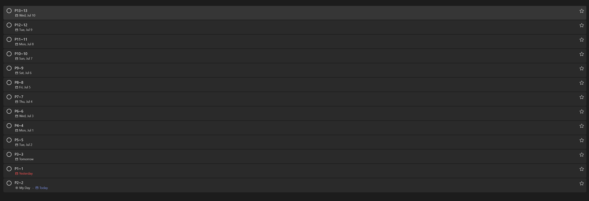

# Microsoft ToDo Helper
The main purpose of this repo is used to pratice for develop with C.  

MicrosoftToDoHelp tool can help creating the Microsoft todo tasks easily, and this program is still developing.

**Currently, this version only support get the token manully. You can use [Microsoft Graph Explorer](https://developer.microsoft.com/en-us/graph/graph-explorer) to acquire the token easily.**

## Required Packages
    apt install libcurl4-openssl-dev
    apt install libjson-c-dev

## Usage
    Usage: todolist -c {todolistName} -n 500 -t {token} -r 50 -s 2024-6-21
            -c, Create todo List
            -n, Num of todo task of todo list
            -t, Token of used for query or create tasks
            -h, Print help message
            -r, Range of tasks, for example if r is 50, then the tasks 1-50,51-100... will be created. 25 is by default.
            -s, Start date of the first task
            -v, Print REST request response.
            -q, List the todo list owned(not support yet)

